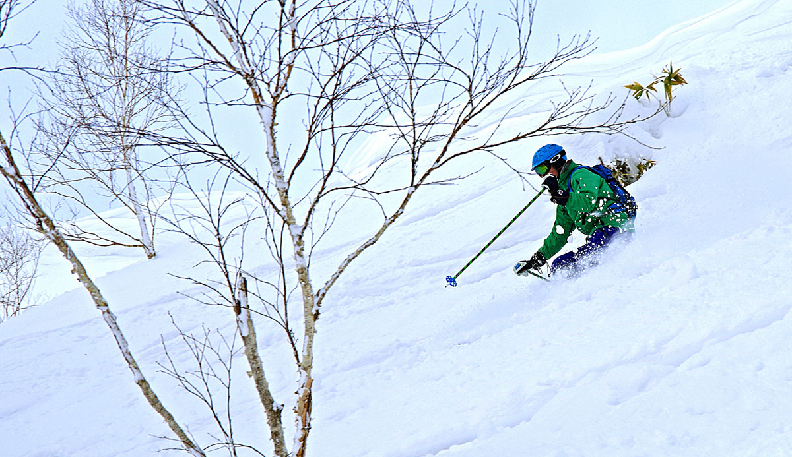
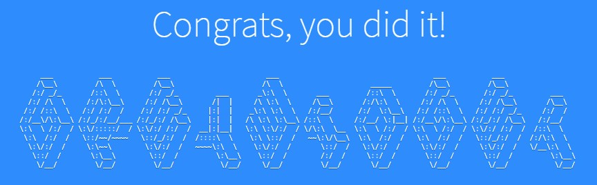

# Welcome to my JamStack Profile Page!

## About Me

I was born in a small town called [levin](https://www.google.co.uk/maps/place/Levin,+New+Zealand/@-40.621871,173.0912261,7z/data=!4m5!3m4!1s0x6d40f3627c967d4d:0x500ef6143a2d9d0!8m2!3d-40.6218489!4d175.2866444) in *New Zealand* and moved to West Yorkshire in 1994 where I've mostly worked as a developer on IBMi machines.

## Stuff I do for fun
- Skiing (**obvs!**)
- Running and mountain biking
- Swimming [total immersion changed my swimming world](https://www.totalimmersion.co.uk/)
- Playing the guitar

**A moment in time:**

Today, with the help of the awesome [RepoRobot](https://github.com/jlord/reporobot) I completed the [jlord git-it tutorial](https://github.com/jlord/git-it-electron)

