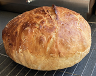

# 

## Kia ora

I was born New Zealand, in a small town called [levin](https://www.google.co.uk/maps/place/Levin,+New+Zealand/@-40.621871,173.0912261,7z/data=!4m5!3m4!1s0x6d40f3627c967d4d:0x500ef6143a2d9d0!8m2!3d-40.6218489!4d175.2866444) and moved to West Yorkshire in 1994 where I've mostly worked as a developer on IBMi machines.

In the last year or so I've started learning to program in [python](https://www.python.org/) and really fallen in love with the language. I've learned a lot and been inspired by listening to [Michael Kennedy's excellent podcast](https://talkpython.fm/) which I mostly listen to as I'm out running on the moors around [Oxenhope](https://en.wikipedia.org/wiki/Oxenhope)

## Life during lockdown
Like most people, I've tried to make the best of lockdown to try and learn some new skills. Here are some of the things that I've been doing:
- Baking  

- Making a mechanical keyboard  

- Learning how to use [Reaper](https://www.reaper.fm/) for recording my guitars:
- I made my first ever opensource contribution as part of [Hactoberfest](https://hacktoberfest.digitalocean.com/) Extra big shout-out to Bob Belderbos at [PyBites](https://pybit.es/) for his patience and kindness

I continue to work on my python skills but have taken a break from my current [100 days of code](https://training.talkpython.fm/courses/details/100-days-of-code-in-python) in order to learn some front-end skill on the exciting [TheCodersGuild JAMStack Course](https://thecodersguild.org.uk/blog/learn-web-and-app-development-with-the-jamstack/)
